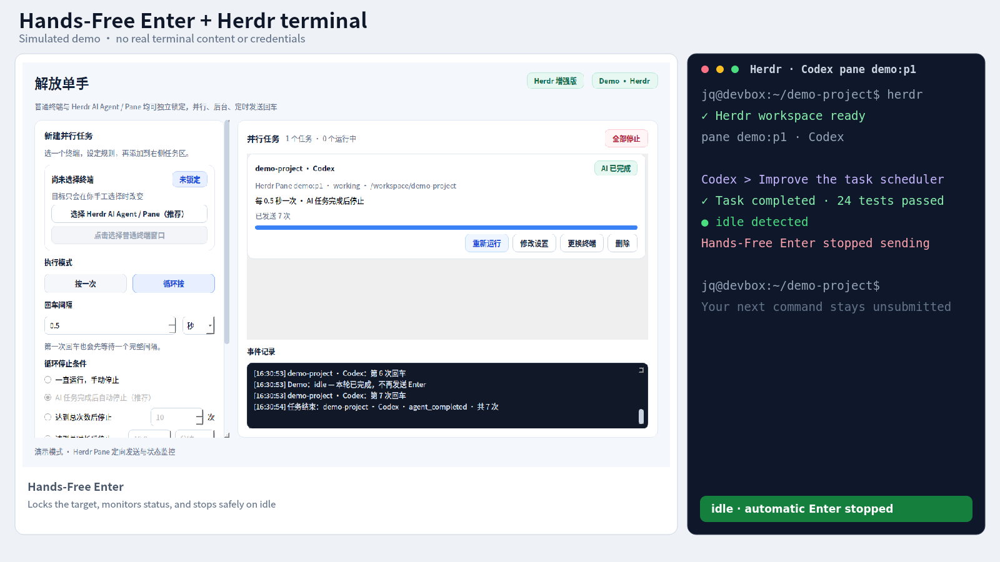

# Hands-Free Enter

<p align="right">
  <a href="README.md">简体中文</a> · <strong>English</strong>
</p>

[](LICENSE)
[](https://github.com/XiangQhello/codex-claude-auto-enter/actions/workflows/tests.yml)

Hands-Free Enter is a multi-task auto-Enter controller for terminal AI agents such as Codex and Claude Code. It locks every task to an explicit window or Herdr pane, sends Enter on a schedule, and can stop automatically when Herdr reports that the current agent turn is idle.

The repository maintains one complete edition. Regular terminal windows remain supported, while Linux users get the safest and most capable workflow by pairing it with [Herdr](https://herdr.dev/).

Keywords: Codex auto Enter, Claude Code automation, Herdr pane, AI agent terminal automation, stop on task completion.

## The problem it solves

Traditional auto-Enter tools stop after a fixed duration or number of key presses, but an AI agent does not have a predictable completion time:

- Stop too early and the agent may still need a confirmation.
- Stop too late and Enter keeps firing after the turn is complete.
- If you start typing the next command, a half-written command can be submitted accidentally.
- With multiple agents, active-window automation can target the wrong terminal.

Hands-Free Enter pins each job to a stable target. With Herdr, it reads the structured agent state and stops as soon as the turn becomes `idle`, instead of guessing how many minutes or Enter presses the task will need.

## Demo

[](assets/demo.mp4)

Click the image to play the MP4. The demo is recorded with the repository's simulated Herdr backend; it contains no real desktop, terminal content, or credentials. Rebuild it with `python scripts/demo/record_demo.py`.

## Why Herdr is recommended

Regular terminal mode depends on operating-system window IDs and keyboard injection and cannot reliably tell whether Codex or Claude Code has completed. Herdr provides stable pane IDs and structured `agent_status`, allowing this application to:

- select the exact Codex or Claude Code pane;
- send Enter through `herdr pane send-keys <pane> enter` without focusing the pane;
- inspect `working`, `blocked`, and `idle` through `herdr pane get <pane>`;
- stop on `idle` and perform one final state check before every Enter;
- work with Herdr panes on Linux Wayland, where arbitrary window injection is blocked.

Herdr is optional. Without it, the application can still target regular terminal windows and stop manually, by count, or by duration.

## Features

- Directed Herdr pane input for Codex, Claude Code, and regular panes
- Automatic stop when an AI turn completes; fail-closed behavior when state cannot be confirmed
- Configurable global state polling interval from 0.5 to 10 seconds
- Stable target lock for regular terminal windows
- Multiple independent tasks running in parallel
- One-shot and repeating Enter schedules
- Manual, count, duration, and agent-completion stop rules
- Per-task stop, restart, edit, retarget, and remove controls
- Native PyQt5 UI with high-DPI support
- Linux, macOS, and Windows launch/install scripts

## Recommended setup: Linux + Herdr

Install and launch Herdr using its [official installation guide](https://herdr.dev/docs/install/):

```bash
curl -fsSL https://herdr.dev/install.sh | sh
herdr
```

Then install Hands-Free Enter:

```bash
git clone https://github.com/XiangQhello/codex-claude-auto-enter.git
cd codex-claude-auto-enter
chmod +x start.sh
./start.sh
```

The launcher reuses a compatible Python/Conda environment when available and creates a local `.venv` otherwise. Override the interpreter with `HANDSFREE_PYTHON=/path/to/python`.

## Herdr workflow

1. Start Codex or Claude Code in Herdr.
2. Click “选择 Herdr AI Agent / Pane”.
3. Select the exact pane instead of the outer terminal window.
4. Choose repeating mode and an Enter interval.
5. Select “AI 任务完成后自动停止（推荐）”.
6. Add and start the task.

| Herdr state | Behavior |
|---|---|
| `working` | Continue monitoring |
| `blocked` | The agent may need input; continue according to the schedule |
| `idle` | Stop immediately without another Enter |
| Query failure or unknown state | Stop safely instead of sending blindly |

The global AI state-check interval only controls polling. It does not change the Enter interval, and a final state check always runs immediately before input is sent.

## Platform support

| Platform | Herdr-directed input | Regular terminal background input |
|---|---|---|
| Linux + Herdr | Supported, including Wayland | X11 only |
| Linux X11/Xorg | Optional | Supported |
| Linux Wayland | Supported through Herdr | Not supported |
| Windows | Not integrated yet | Experimental Win32 messages |
| macOS | Not integrated yet | Experimental process-directed events |

## Development

```bash
python -m unittest discover -s tests -v
```

Read [CONTRIBUTING.md](CONTRIBUTING.md) before submitting changes. Report security issues privately as described in [SECURITY.md](SECURITY.md). See [CHANGELOG.md](CHANGELOG.md) for release history and [THIRD_PARTY_NOTICES.md](THIRD_PARTY_NOTICES.md) for upstream attribution.

Build a portable source package with:

```bash
./scripts/build/制作跨电脑安装包.sh
```

## License

This project is licensed under the [GNU General Public License v3.0](LICENSE), SPDX identifier `GPL-3.0-only`, to remain compatible with PyQt5's GPL v3 open-source license. Distribution of modified or combined versions must follow GPLv3 source-availability and notice requirements.

## Herdr attribution

This project calls the Herdr CLI/API for pane discovery, directed keys, and agent state. It does not bundle or modify Herdr source code.

- Website: [herdr.dev](https://herdr.dev/)
- Documentation: [herdr.dev/docs](https://herdr.dev/docs/)
- Source: [ogulcancelik/herdr](https://github.com/ogulcancelik/herdr)
- License: [Apache License 2.0](https://github.com/ogulcancelik/herdr/blob/master/LICENSE)

Codex, Claude Code, Herdr, and their names and trademarks belong to their respective owners. This repository is not officially affiliated with or endorsed by those projects or maintainers.

## Safety

Auto-Enter confirms whatever the target terminal currently displays. Do not use it to automatically approve deletion, overwrite, publishing, or other actions that require human judgment. Prefer conservative count or duration limits for regular terminals whose agent state cannot be inspected.
