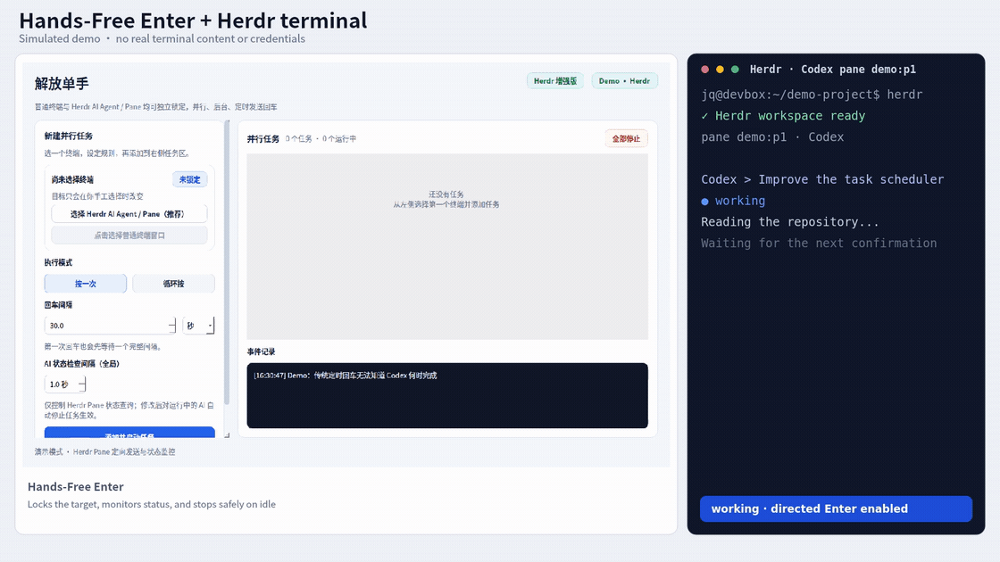

# Hands-Free Enter（解放单手）

<p align="right">
  <strong>简体中文</strong> · <a href="README.en.md">English</a>
</p>

[](LICENSE)
[](https://github.com/XiangQhello/codex-claude-auto-enter/actions/workflows/tests.yml)

面向 Codex、Claude Code 等终端 AI Agent 的多任务自动回车控制台：锁定准确目标，并在 Herdr 报告任务完成后自动停止。

## 解决的痛点

传统自动回车只能预设次数或时长，但 AI 任务耗时并不固定：

- 停得太早，Agent 仍在等待确认；
- 停得太晚，持续发送的 Enter 会误提交你正在输入的半条命令；
- 多终端并行时，活动窗口方案还可能把 Enter 发错位置。

Hands-Free Enter 将任务固定到具体窗口或 Herdr Pane。配合 Herdr 时，它会读取 `working`、`blocked`、`idle` 状态，在任务变为 `idle` 后立即停止。

## Demo



[下载高清 MP4](https://raw.githubusercontent.com/XiangQhello/codex-claude-auto-enter/main/assets/demo.mp4) · [查看可重复录制脚本](scripts/demo/record_demo.py)

> Demo 左侧是 Hands-Free Enter，右侧是模拟的 Herdr Codex 终端。GitHub 不会稳定地在 README 内嵌播放 MP4，因此主页使用轻量 GIF 预览；上方链接可下载当前 `main` 的 MP4。

## 快速开始

无需安装 Herdr，也可以先用普通终端模式快速体验：

```bash
git clone https://github.com/XiangQhello/codex-claude-auto-enter.git
cd codex-claude-auto-enter
chmod +x start.sh
./start.sh
```

启动后点击“选择普通终端窗口”，即可按次数、时长或手动停止规则发送 Enter。

需要精确锁定 Codex / Claude Code Pane，并在任务完成后自动停止时，再安装推荐的 [Herdr](https://herdr.dev/docs/install/)：

```bash
curl -fsSL https://herdr.dev/install.sh | sh
herdr
```

启动器会优先复用带 PyQt5 的 Python/Conda 环境，否则创建本地 `.venv`。也可以指定解释器：

```bash
HANDSFREE_PYTHON=/路径/到/python ./start.sh
```

macOS 双击 `start.command`；Windows 双击 `start.bat`。

## 使用方式

### 普通终端模式

1. 点击“选择普通终端窗口”，再点击目标终端。
2. 设置 Enter 间隔以及次数、时长或手动停止条件。
3. 添加并启动任务。

普通终端模式无需 Herdr，可以快速体验；但它无法读取 Agent 完成状态。

### Herdr 模式（推荐）

1. 在 Herdr 中启动 Codex 或 Claude Code。
2. 点击“选择 Herdr AI Agent / Pane”，锁定具体 Pane。
3. 选择循环发送并设置 Enter 间隔。
4. 停止条件选择“AI 任务完成后自动停止（推荐）”。
5. 添加并启动任务。

Herdr 提供更可靠的 Pane 定向发送与任务完成自动停止，但不是运行本工具的强制依赖。

## 核心能力

- Herdr Pane 定向发送，不要求目标位于前台；
- Agent 变为 `idle` 后自动停止，查询失败时安全停止；
- 可视化调整状态轮询间隔（`0.5～10 秒`）；
- 多个终端或 Pane 并行运行独立任务；
- 固定目标，避免跟随当前活动窗口误发；
- Linux、macOS、Windows 启动脚本。

| 平台 | Herdr 定向发送 | 普通终端后台发送 |
|---|---|---|
| Linux + Herdr | 支持，含 Wayland | X11 支持 |
| Linux X11/Xorg | 可选 | 支持 |
| Linux Wayland | 支持 | 不支持 |
| Windows | 尚未接入 | 实验支持 |
| macOS | 尚未接入 | 实验支持 |

## 文档

- [贡献指南](docs/CONTRIBUTING.md)
- [安全策略](docs/SECURITY.md)
- [更新记录](docs/CHANGELOG.md)
- [第三方声明](docs/THIRD_PARTY_NOTICES.md)
- [English README](README.en.md)

开发测试：

```bash
python -m unittest discover -s tests -v
```

## Herdr 与许可证

[Herdr](https://herdr.dev/) 是独立的 Apache-2.0 开源项目。本工具只调用其公开 CLI/API，不包含或修改 Herdr 源码。项目采用 [GPL-3.0-only](LICENSE)，以兼容 PyQt5 的 GPL v3 许可。

自动回车会确认目标终端当前显示的内容。请勿用它自动批准删除、覆盖、发布或其他需要人工判断的危险操作。
